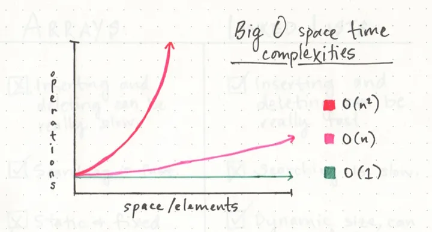

# Class 01 Reading Notes: The Big O Notation, Immutable vs. Mutable Objects, Pain vs. Suffering

sources:

- [Pain vs. Suffering](https://codefellows.github.io/code-401-python-guide/curriculum/class-01/notes/pain_suffering)
- [Beginners Guide to Big O](https://rob-bell.net/2009/06/a-beginners-guide-to-big-o-notation/
- [Season 1, Episode 6, A friendly intro to Big O Notation](https://www.codenewbie.org/basecs/8)
- [Names and Values in Python](https://www.youtube.com/watch?v=_AEJHKGk9ns)
- chatGPT

## In the context of the reading “Pain and Suffering,” describe the main challenges faced by beginners when learning Python and suggest at least two strategies for overcoming these obstacles.

### Challenges

- being pushed mentally, physically and emotionally
- dealing with uncertainty
- losing sleep
- figuring out how to collaborate with new people, each with their own quirks

### Strategies

- know *why* you are doing this and what you want at the end of the journey
- build your resources and reach out to your community

## After reading “Beginners Guide to Big O,” explain the concept of time complexity and space complexity



1. **Time Complexity:**
    - **Definition:** Time complexity refers to the amount of time an algorithm takes to run based on the size of its input.
    - **Expressed with Big O:** It is expressed using Big O notation, such as O(1), O(n), or O(n²), where n is the size of the input.
    - **Example:** An O(1) function takes constant time, meaning it always takes the same amount of time regardless of input size. An O(n) function is linear, indicating that its time complexity grows linearly with the size of the input. An O(n²) function takes exponentially more time as the input size increases.
2. **Space Complexity:**
    - **Definition:** Space complexity is a measure of the amount of memory (space) an algorithm needs to run based on the size of its input.
    - **Expressed with Big O:** Like time complexity, space complexity is expressed using Big O notation, such as O(1), O(n), or O(n²), where n is the size of the input.
    - **Example:** An O(1) function has constant space complexity, meaning it uses a fixed amount of memory regardless of input size. An O(n) function has linear space complexity, growing proportionally with the input size. An O(n²) function has quadratic space complexity, indicating a significant increase in memory usage as the input size grows.
3. **Use in Algorithm Evaluation:**
    - **Purpose:** Big O Notation helps evaluate the efficiency of algorithms by considering how their runtime and memory requirements grow with the input size.
    - **Tradeoffs:** Developers strive to choose algorithms that strike a balance between efficiency and tradeoffs, considering factors like time and space complexity.
    - **Avoiding Inefficient Algorithms:** Algorithms with higher complexities, such as O(n²), are generally avoided in favor of more efficient alternatives to prevent exponential increases in time and memory usage.

Big O Notation provides a standardized way to express and compare the efficiency of algorithms by analyzing their time and space complexities, which are crucial considerations in algorithm design and evaluation.

## Based on the “Names and Values in Python” reading, explain the difference between mutable and immutable data types in Python

In Python, the distinction between mutable and immutable data types lies in how they handle changes to their values. The key difference is whether the object's state can be modified after it is created.

### Mutable Data Types

- **Definition:** Mutable objects allow changes to their state or content after creation. This means you can modify the values, add or remove elements, and the object itself can be altered in-place.
- **Examples:** Lists, dictionaries, and sets are common examples of mutable data types.
- **Behavior:** When you modify a mutable object, you are working with the same object in memory. If two variables reference the same mutable object, changes made through one variable will be reflected in the other.

```python
# Example of a mutable list
my_list = [1, 2, 3]
my_list[0] = 100  # Modifying the list in-place
```

### Immutable Data Types

- **Definition:** Immutable objects, once created, cannot be altered or modified. Any operation that appears to modify the object actually creates a new object with the updated value.
- **Examples:** Integers, floats, strings, and tuples are examples of immutable data types.
- **Behavior:** When you perform an operation that seems to modify an immutable object, a new object is created in memory, and the original object remains unchanged. Variables referencing the original object still point to the original value.

```python
# Example of an immutable tuple
my_tuple = (1, 2, 3)
new_tuple = my_tuple + (4, 5)  # Creating a new tuple with updated values
```

**Key Considerations:**

- **Memory Management:** Mutable objects can be more memory-efficient in some cases since changes are made in-place. Immutable objects, on the other hand, might consume more memory as new objects are created for every modification.
- **Use Cases:** Immutable types are useful when you want to ensure data integrity and avoid unintended modifications. Mutable types are handy for scenarios where you need to modify data structures frequently.
- **Concurrency:** Immutable objects are inherently thread-safe since their state cannot be changed. This makes them suitable for concurrent programming.

### "Change" is unclear

- changing an integer: rebinding `x = x + 1` (creates new int)
- changing a list: mutating `nums.append(7)`
- can rebind lists `nums = nums + [7]`
- can't mutate an int: ints are immutable

### Mutable and immutable are assigned the same

- Assignment is the same for all values.
- Aliasing can make it seem different.
