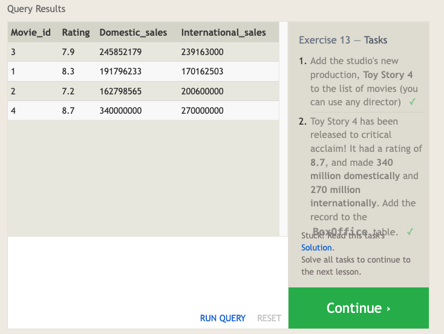
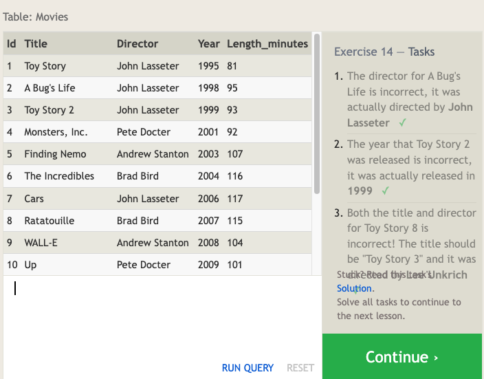
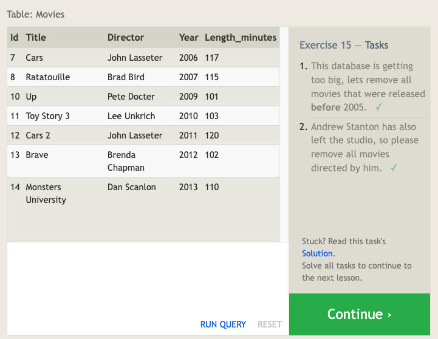
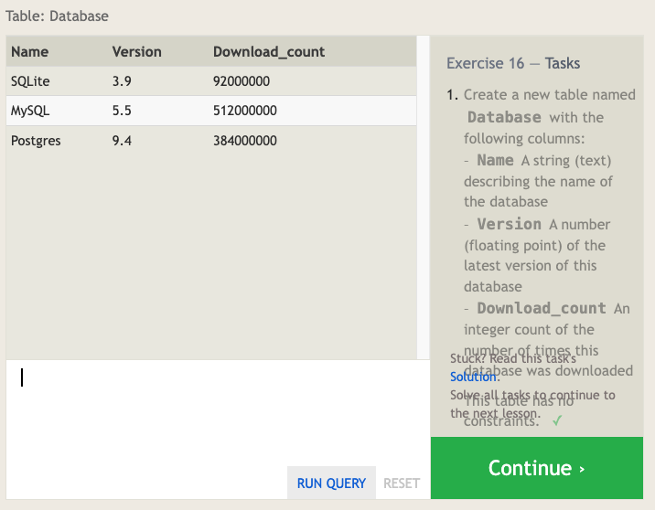
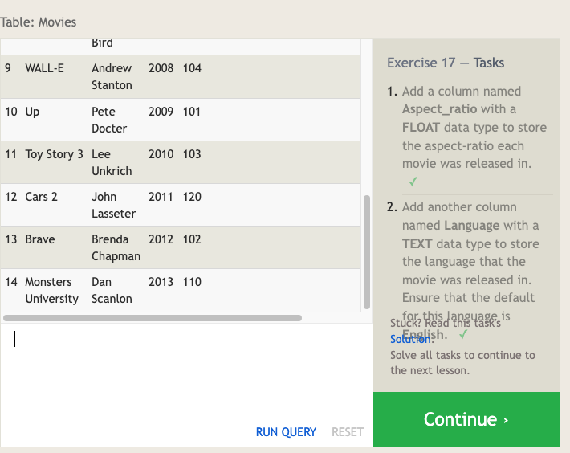
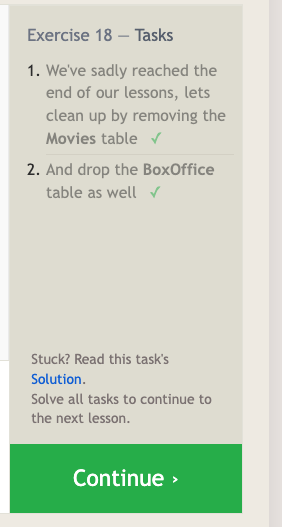

# SQL

*sources*: [SQL Bolt Tutorials](https://sqlbolt.com/), [SQL Database Tutorial for Beginners](https://www.computer-pdf.com/3-sql-database-tutorial-for-beginners), ChatGPT

## Overview

- SQL Language: Industry-standard language for managing databases, used to query, analyze, and create tables, views, indexes, and schemas.
- Usefulness: Essential for database applications and managing data effectively.
- Popular Databases: SQL is supported by various databases such as Oracle, SQL Server, MySQL, Sybase, and PostgreSQL.
- Learning SQL: Learning SQL is crucial for anyone dealing with databases, providing a standardized language for managing and querying data.

## Relational Databases

- Structure: Relational databases consist of related tables, resembling Excel spreadsheets with named columns (attributes) and rows (data instances).
- Entity Concept: Tables in SQL represent entities (e.g., Dogs), and rows represent specific instances of those entities (e.g., pug, beagle).

### SQL Lesson 1: SELECT queries 101

SELECT Statements: Used to retrieve data from a SQL database.
Basic Syntax:

```sql
SELECT column, another_column, … FROM mytable;
```


### SQL Lesson 2: Queries with constraints (Pt. 1)

WHERE Clause: Filters results based on specified conditions.

#### select query with constraints

```sql
SELECT column, another_column, …
FROM mytable
WHERE condition
    AND/OR another_condition
    AND/OR …;
```

> SQL doesn't _require_ you to write the keywords all capitalized, but as a convention, it helps people distinguish SQL keywords from column and tables names, and makes the query easier to read.


### SQL Lesson 3: Queries with constraints (Pt. 2)

- Text Data Operators: Used for string comparisons and wildcard pattern matching.
- When writing `WHERE` clauses with columns containing text data, SQL supports a number of useful operators to do things like case-insensitive string comparison and wildcard pattern matching.

```sql
SELECT title, director FROM movies 
WHERE director = "John Lasseter";
```

> All strings must be quoted so that the query parser can distinguish words in the string from SQL keywords.


### SQL Lesson 4: Filtering and Sorting Query Results

- `DISTINCT` Keyword: Removes duplicate rows from results.
- `ORDER BY` Clause: Sorts results in ascending (`ASC`) or descending (`DESC`) order.

#### select query with unique results

```sql
SELECT DISTINCT column, another_column, …
FROM mytable
WHERE condition(s);
```

#### select query with ordered results

```sql
SELECT column, another_column, …
FROM mytable
WHERE condition(s)
ORDER BY column ASC/DESC;
```

The `LIMIT` will reduce the number of rows to return, and the optional `OFFSET` will specify where to begin counting the number rows from.

#### Select query with limited rows

```sql
SELECT column, another_column, …
FROM mytable
WHERE condition(s)
ORDER BY column ASC/DESC
LIMIT num_limit OFFSET num_offset;
```


### SQL Lesson 5: Simple SELECT Queries

List all the cities west of Chicago, ordered from west to east

```sql
SELECT city, longitude FROM north_american_cities
WHERE longitude < -87.629798
ORDER BY longitude ASC;
```


### SQL Lesson 6: Multi-table queries with JOINs

- Normalization: Data stored across multiple tables to minimize duplication.
- JOIN Clause: Combines rows from different tables based on a shared key.
- INNER JOIN: Matches rows with the same key in both tables.

#### Select query with INNER JOIN on multiple tables

```sql
SELECT column, another_table_column, …
FROM mytable
INNER JOIN another_table 
    ON mytable.id = another_table.id
WHERE condition(s)
ORDER BY column, … ASC/DESC
LIMIT num_limit OFFSET num_offset;
```

> INNER JOIN is equivalent to JOIN

Show the sales numbers for each movie that did better internationally rather than domestically

```sql
SELECT title, domestic_sales, international_sales
FROM movies
  JOIN boxoffice
    ON movies.id = boxoffice.movie_id
WHERE international_sales > domestic_sales;
```


### SQL Lesson 13: Inserting Rows

- Schema: Describes the table structure and data types for each column.
- `INSERT` Statement: Used to add new data to a table.
- Forward Compatibility: Inserting specific columns allows forward compatibility when new columns are added.

#### Insert statement with values for all columns

```sql
INSERT INTO mytable
VALUES (value_or_expr, another_value_or_expr, …),
       (value_or_expr_2, another_value_or_expr_2, …),
       …;
```

#### Insert statement with specific columns

inserting values this way has the benefit of being forward compatible. For example, if you add a new column to the table with a default value, no hardcoded `INSERT` statements will have to change as a result to accommodate that change.

```sql
INSERT INTO mytable
(column, another_column, …)
VALUES (value_or_expr, another_value_or_expr, …),
      (value_or_expr_2, another_value_or_expr_2, …),
      …;
```

Add the studio's new production, **Toy Story 4** to the list of movies (you can use any director)

```sql
INSERT INTO movies VALUES (4, "Toy Story 4", "El Directore", 2015, 90);
```



### SQL Lesson 14: Updating Rows

- `UPDATE` Statement: Modifies existing data in a table based on specified conditions.

Syntax:

```sql
UPDATE mytable
SET column = value_or_expr, 
    other_column = another_value_or_expr, 
    …
WHERE condition;
```

> helpful tip is to always write the constraint first and test it in a `SELECT` query to make sure you are updating the right rows, and only then writing the column/value pairs to update.

Both the title and director for Toy Story 8 is incorrect! The title should be "Toy Story 3" and it was directed by **Lee Unkrich**

```sql
UPDATE movies
SET title = "Toy Story 3", director = "Lee Unkrich"
WHERE id = 11;
```



### SQL Lesson 15: Deleting Rows

- `DELETE` Statement: Removes data from a table based on specified conditions.

Syntax:

```sql
DELETE FROM mytable
WHERE condition;
```

Andrew Stanton has also left the studio, so please remove all movies directed by him.

```sql
DELETE FROM movies
WHERE director = "Andrew Stanton"
```

> Precaution: Always run the constraint in a SELECT query first to ensure proper rows are being deleted.



### SQL Lesson 16: Creating Tables

- CREATE TABLE Statement: Establishes a new table with defined columns, data types, constraints, and default values.
- Table Data Types: INTEGER, BOOLEAN, FLOAT, DOUBLE, REAL, CHARACTER, VARCHAR, TEXT, DATE, DATETIME, BLOB.
- Table Constraints: PRIMARY KEY, AUTOINCREMENT, UNIQUE, NOT NULL, CHECK (expression), FOREIGN KEY.

Example schema:

```sql
CREATE TABLE movies (
    id INTEGER PRIMARY KEY,
    title TEXT,
    director TEXT,
    year INTEGER, 
    length_minutes INTEGER
);
```



### SQL Lesson 17: Altering Tables

- `ALTER TABLE` Statement: Adds, removes, or modifies columns and constraints.

#### Altering table to add new column(s)

```sql
ALTER TABLE mytable
ADD column DataType OptionalTableConstraint 
    DEFAULT default_value;
```

#### Altering table to remove column(s)

```sql
ALTER TABLE mytable
DROP column_to_be_deleted;
```

#### Altering table name

```sql
ALTER TABLE mytable
RENAME TO new_table_name;
```

> Each database implementation supports different methods of altering their tables, so it's always best to consult your database docs before proceeding: [MySQL](https://dev.mysql.com/doc/refman/5.6/en/alter-table.html "MySQL Alter Table"), [Postgres](http://www.postgresql.org/docs/9.4/static/sql-altertable.html "Postgres Alter Table"), [SQLite](https://www.sqlite.org/lang_altertable.html "SQLite Alter Table"), [Microsoft SQL Server](https://msdn.microsoft.com/en-us/library/ms190273.aspx "Microsoft SQL Server Alter Table").



### SQL Lesson 18: Dropping Tables

- `DROP TABLE` Statement: Removes an entire table, including data and metadata.

Syntax:

```sql
DROP TABLE IF EXISTS mytable;
```

Dependency Consideration: If a table has dependent tables (e.g., with FOREIGN KEY dependencies), address dependencies before dropping the table.

