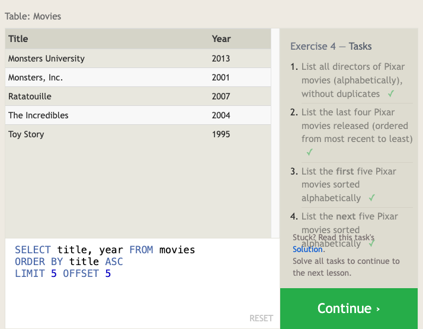

# SQL

*sources*: [SQL Bolt Tutorials](https://sqlbolt.com/), [SQL Database Tutorial for Beginners](https://www.computer-pdf.com/3-sql-database-tutorial-for-beginners), ChatGPT

## Overview

- SQL Language: Industry-standard language for managing databases, used to query, analyze, and create tables, views, indexes, and schemas.
- Usefulness: Essential for database applications and managing data effectively.
- Popular Databases: SQL is supported by various databases such as Oracle, SQL Server, MySQL, Sybase, and PostgreSQL.
- Learning SQL: Learning SQL is crucial for anyone dealing with databases, providing a standardized language for managing and querying data.

## Relational Databases

- Structure: Relational databases consist of related tables, resembling Excel spreadsheets with named columns (attributes) and rows (data instances).
- Entity Concept: Tables in SQL represent entities (e.g., Dogs), and rows represent specific instances of those entities (e.g., pug, beagle).

### SQL Lesson 1: SELECT queries 101

SELECT Statements: Used to retrieve data from a SQL database.
Basic Syntax:

```sql
SELECT column, another_column, … FROM mytable;
```


### SQL Lesson 2: Queries with constraints (Pt. 1)

WHERE Clause: Filters results based on specified conditions.

#### select query with constraints

```sql
SELECT column, another_column, …
FROM mytable
WHERE condition
    AND/OR another_condition
    AND/OR …;
```

> SQL doesn't _require_ you to write the keywords all capitalized, but as a convention, it helps people distinguish SQL keywords from column and tables names, and makes the query easier to read.


### SQL Lesson 3: Queries with constraints (Pt. 2)

- Text Data Operators: Used for string comparisons and wildcard pattern matching.
- When writing `WHERE` clauses with columns containing text data, SQL supports a number of useful operators to do things like case-insensitive string comparison and wildcard pattern matching.

```sql
SELECT title, director FROM movies 
WHERE director = "John Lasseter";
```

> All strings must be quoted so that the query parser can distinguish words in the string from SQL keywords.


### SQL Lesson 4: Filtering and Sorting Query Results

- `DISTINCT` Keyword: Removes duplicate rows from results.
- `ORDER BY` Clause: Sorts results in ascending (`ASC`) or descending (`DESC`) order.

#### select query with unique results

```sql
SELECT DISTINCT column, another_column, …
FROM mytable
WHERE condition(s);
```

#### select query with ordered results

```sql
SELECT column, another_column, …
FROM mytable
WHERE condition(s)
ORDER BY column ASC/DESC;
```

The `LIMIT` will reduce the number of rows to return, and the optional `OFFSET` will specify where to begin counting the number rows from.

#### Select query with limited rows

```sql
SELECT column, another_column, …
FROM mytable
WHERE condition(s)
ORDER BY column ASC/DESC
LIMIT num_limit OFFSET num_offset;
```



### SQL Lesson 5: Simple SELECT Queries

List all the cities west of Chicago, ordered from west to east

```sql
SELECT city, longitude FROM north_american_cities
WHERE longitude < -87.629798
ORDER BY longitude ASC;
```


### SQL Lesson 6: Multi-table queries with JOINs

- Normalization: Data stored across multiple tables to minimize duplication.
- JOIN Clause: Combines rows from different tables based on a shared key.
- INNER JOIN: Matches rows with the same key in both tables.


#### Select query with INNER JOIN on multiple tables

```sql
SELECT column, another_table_column, …
FROM mytable
INNER JOIN another_table 
    ON mytable.id = another_table.id
WHERE condition(s)
ORDER BY column, … ASC/DESC
LIMIT num_limit OFFSET num_offset;
```

> INNER JOIN is equivalent to JOIN

Show the sales numbers for each movie that did better internationally rather than domestically

```sql
SELECT title, domestic_sales, international_sales
FROM movies
  JOIN boxoffice
    ON movies.id = boxoffice.movie_id
WHERE international_sales > domestic_sales;
```
